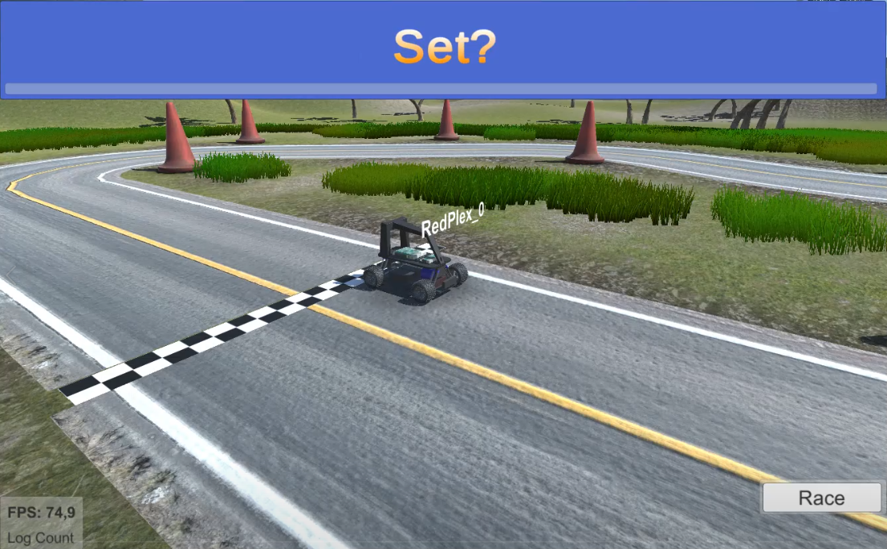

# Virtual_Racing
A repo that uses the donkey car simulator in order to train/test and compete in virtual races !

# demo video (click on the image)

# documentation for the donkey Car Simulator
https://docs.donkeycar.com/guide/virtual_race_league/

# download latest versions of the simulator
https://github.com/tawnkramer/gym-donkeycar/releases/
